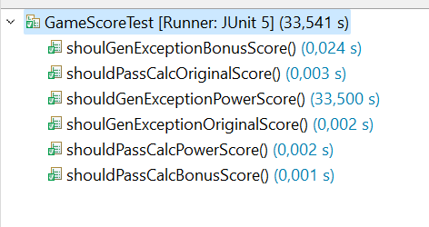

# Laboratorio 4

## Parte 1

### Integrantes
- Juan Pablo Fonseca
- Santiago Cardenas

### Clases de equivalencias
Para los 3 tipos de gameScore las clases de equivalencia son:

    1. Cuando el puntaje es menor a cero
    2. Cuando el puntaje es mayor o igual a cero

### Condiciones de frontera
- puntaje = 0

### Pruebas

## Parte 2

Cosas que se hicieron para implementar el patron de inversión de control:
- Se añadió google GUICE en el pom.xml
- En swingProject.java se llamó e implementó el método `createGUIUsingGuice` en lugar de `createGUIUsingFactoryMethod`
- Se añadió  `GameScore` como parametro al constructor `GUI`
- En `HangmanFactoryServices` se realizó la inyección de dependencias.

