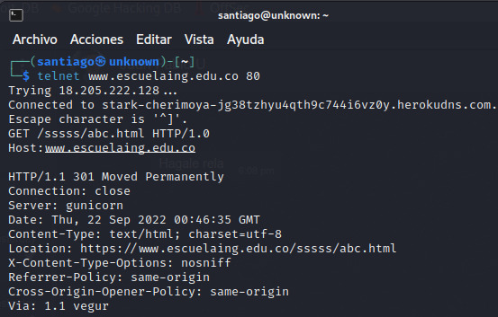
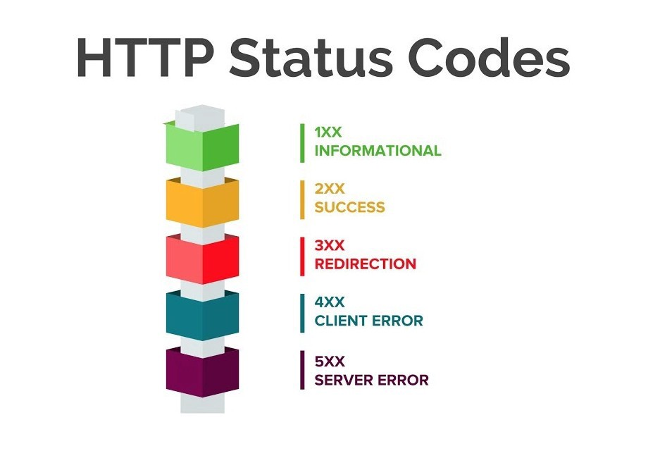
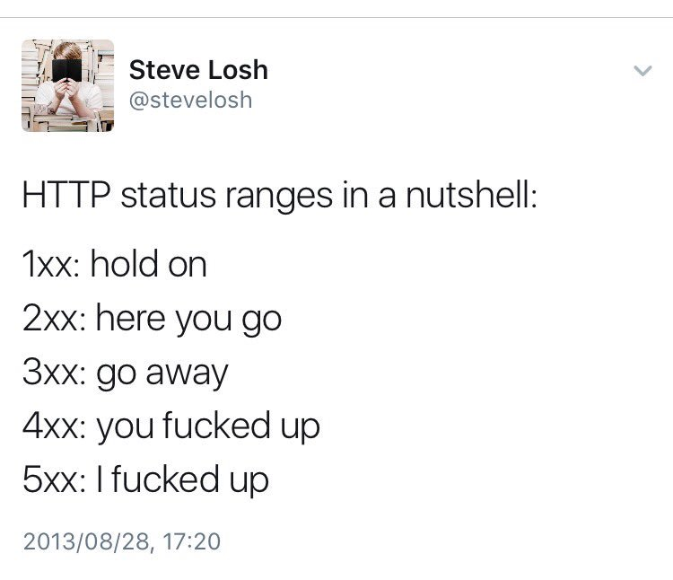
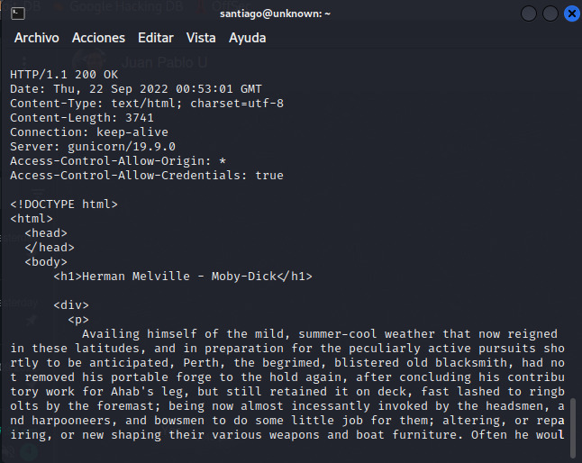
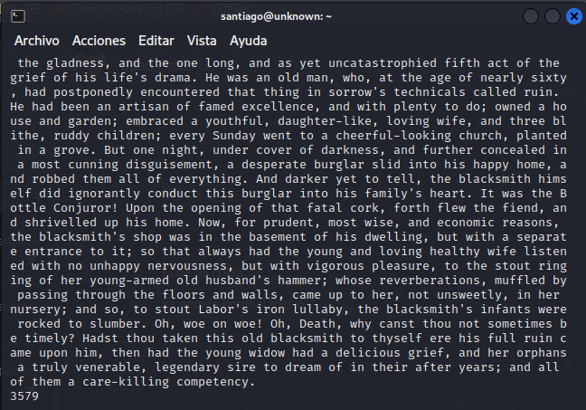
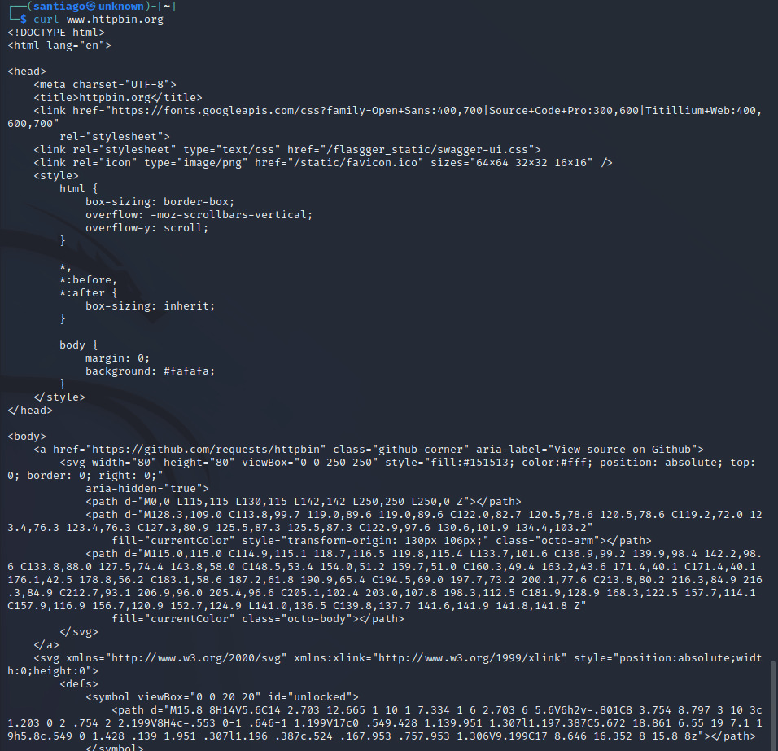
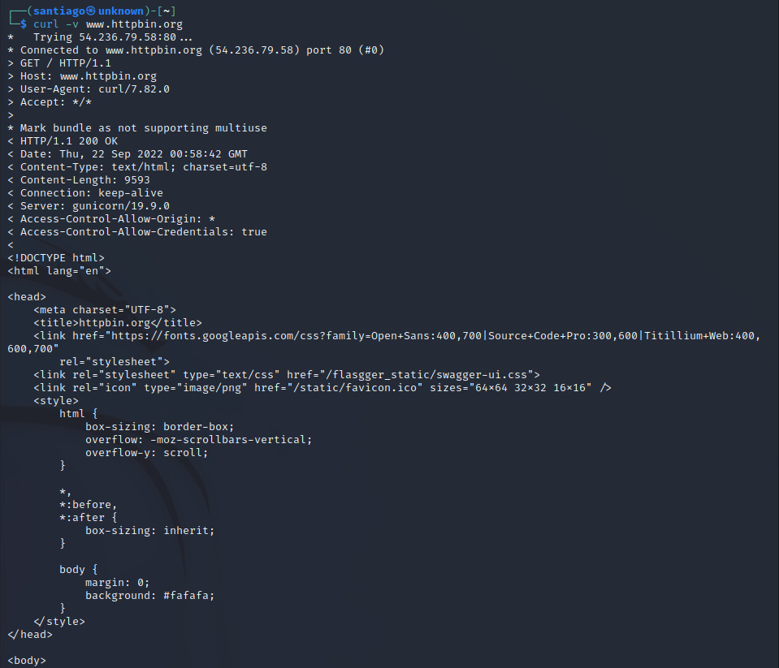
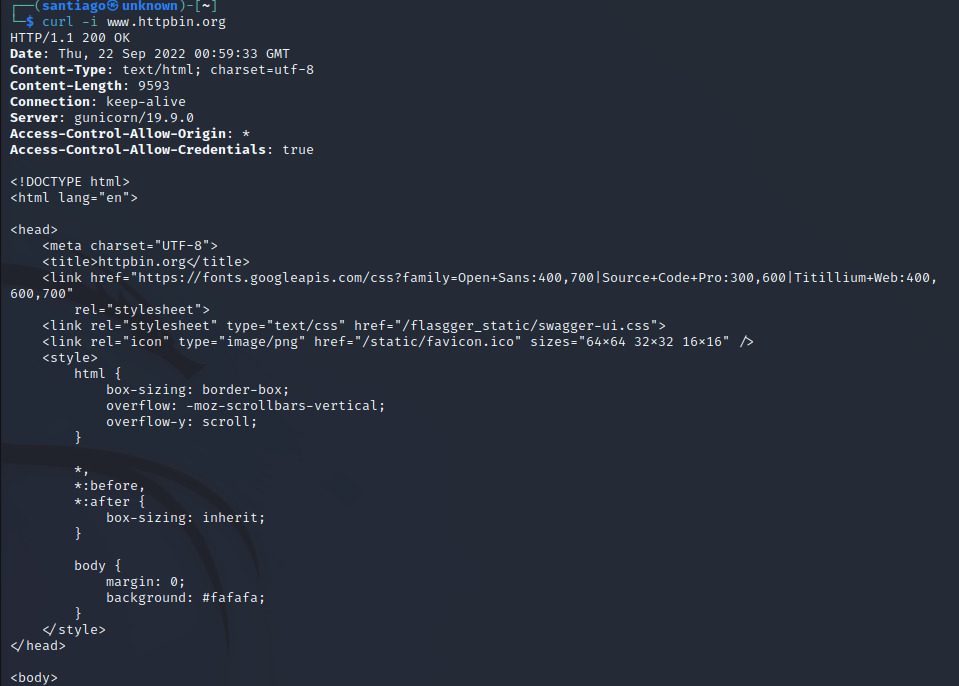
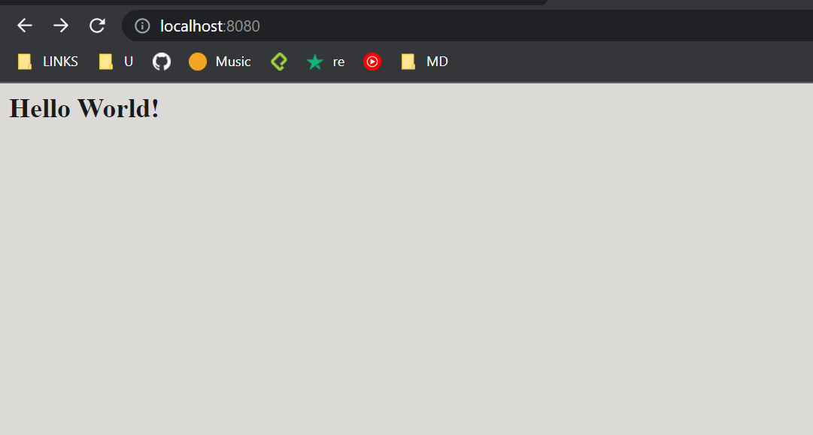
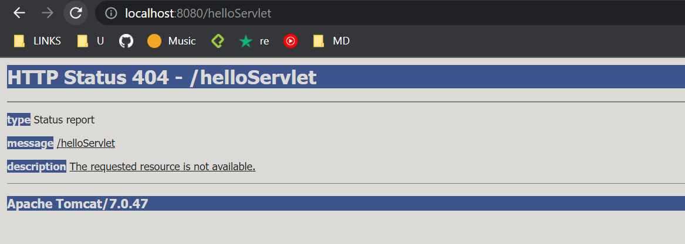

# Laboratorio 5

## PARTE 1. JUGANDO A SER UN CLIENTE HTTP
 
3.Para la peticion GET la syntaxis que maneja es:

GET /"El recurso que se quiere traer" "Protocolo a usar"/"Version del protocolo

Host:"URL de la cual se va a buscar el recurso"

GET /sssss/abc.html HTTP/1.0 
Host:www.escuelaing.edu.co 

El codigo 301 dice que la peticion que se esta haciendo ya no se encuenta en en el url dado, a continuacion mostramos la tabla resumen de los codigos de estado de HTTP

4. Luego de hacer el GET a la nueva URL nos devuelve lo siguiente:

5. Luego de usar el comando wc -c y pegar el texto obtenido en la peticion GET no arroja el numero de lineas las cuales dieron 3579.

//TODO

6. Usando el comando "curl"

El parametro "-v" lo que hace es mostrar mas informacion de la peticion que se esta haciendo,para este caso nos muesta al inicio información con una syntaxis similar a la que se uso en telnet en el paso anterior.

El parametro "-i" nos muestra mas informacion extra de la peticion como el tipo de contenido, el numero de lineas, servidor entre otra.

## PARTE 2. HACIENDO UNA APLCIACIÓN WEB DINÁMICA A BAJO NIVEL
// TODO SampleServlet class

El puerto TCP/IP de Tomcat está configurado como el 8080

