# Laboratorio 5

## PARTE 1. JUGANDO A SER UN CLIENTE HTTP
 
3.Para la peticion GET la syntaxis que maneja es:

GET /"El recurso que se quiere traer" "Protocolo a usar"/"Version del protocolo

Host:"URL de la cual se va a buscar el recurso"

GET /sssss/abc.html HTTP/1.0 
Host:www.escuelaing.edu.co 

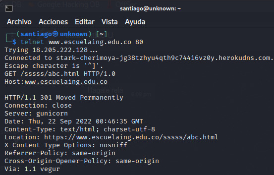

El codigo 301 dice que la peticion que se esta haciendo ya no se encuenta en en el url dado, a continuacion mostramos la tabla resumen de los codigos de estado de HTTP

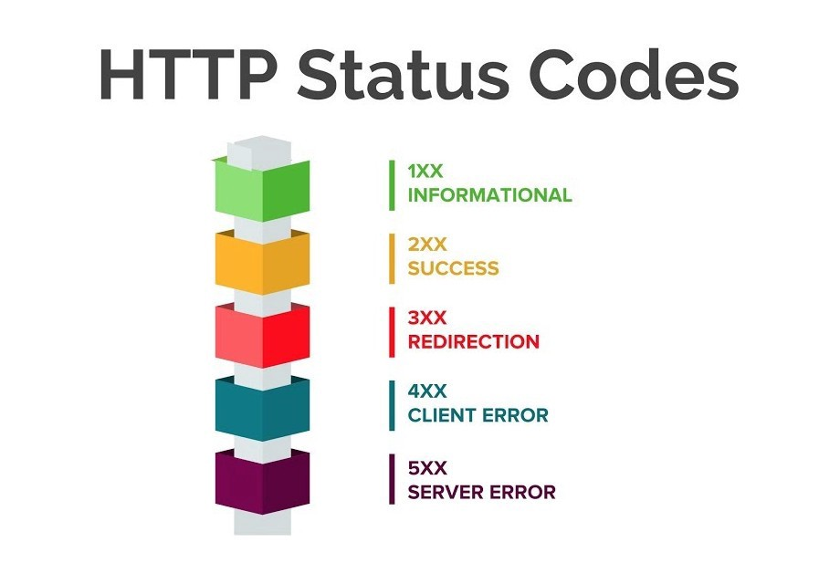

4. Luego de hacer el GET a la nueva URL nos devuelve lo siguiente:
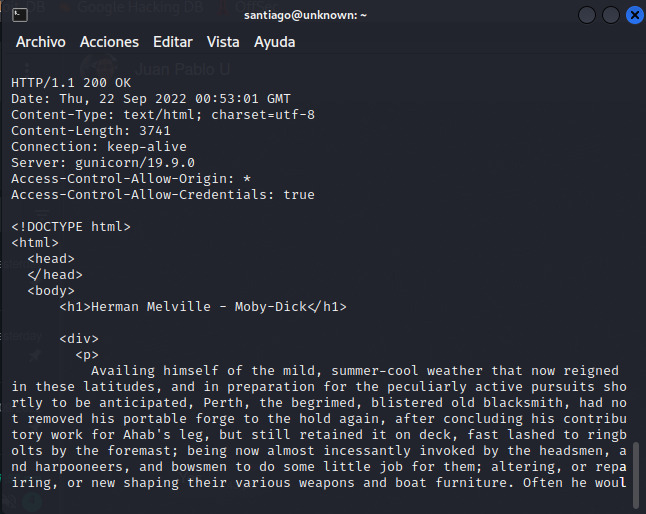

5. Luego de usar el comando wc -c y pegar el texto obtenido en la peticion GET no arroja el numero de lineas las cuales dieron 3579.
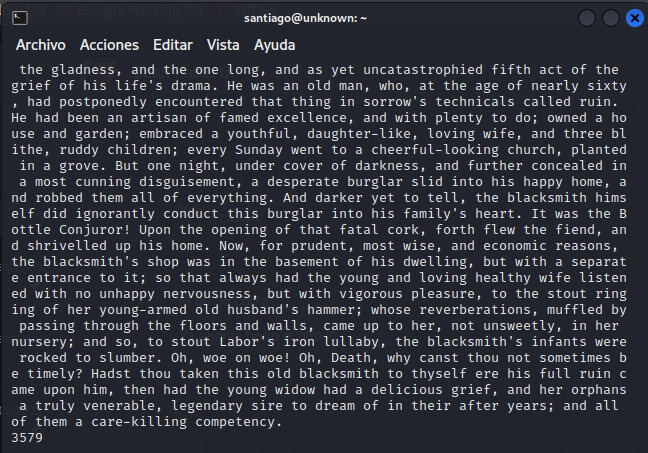

La diferencia entre el metodo GET y POST es que el primero de configuró para traer información, mientras que el segundo se hizo para postear o publicar nueva información. Otros Verbos o métodos son: PUT, HEAD, DELETE

6. Usando el comando "curl"
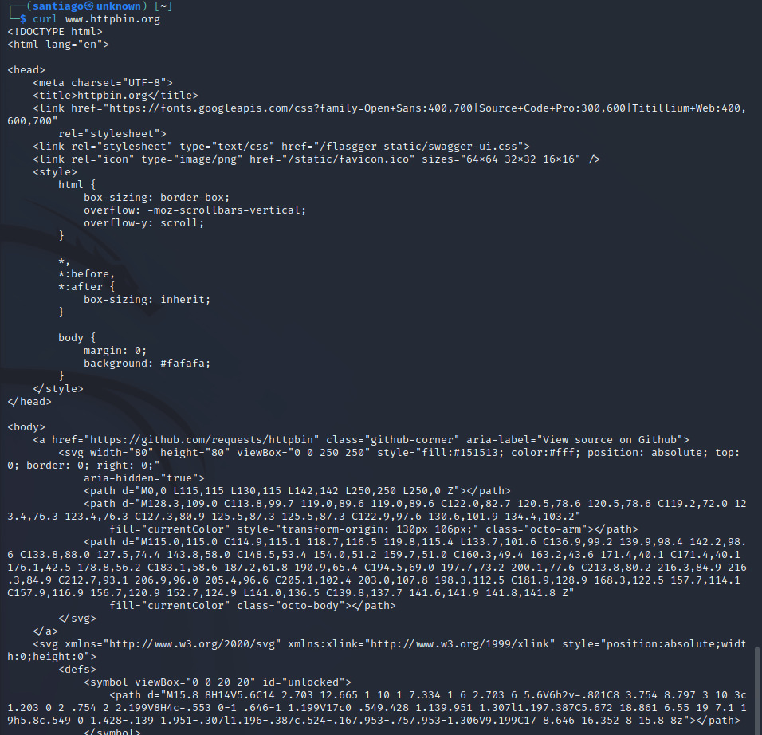

El parametro "-v" lo que hace es mostrar mas informacion de la peticion que se esta haciendo,para este caso nos muesta al inicio información con una syntaxis similar a la que se uso en telnet en el paso anterior.
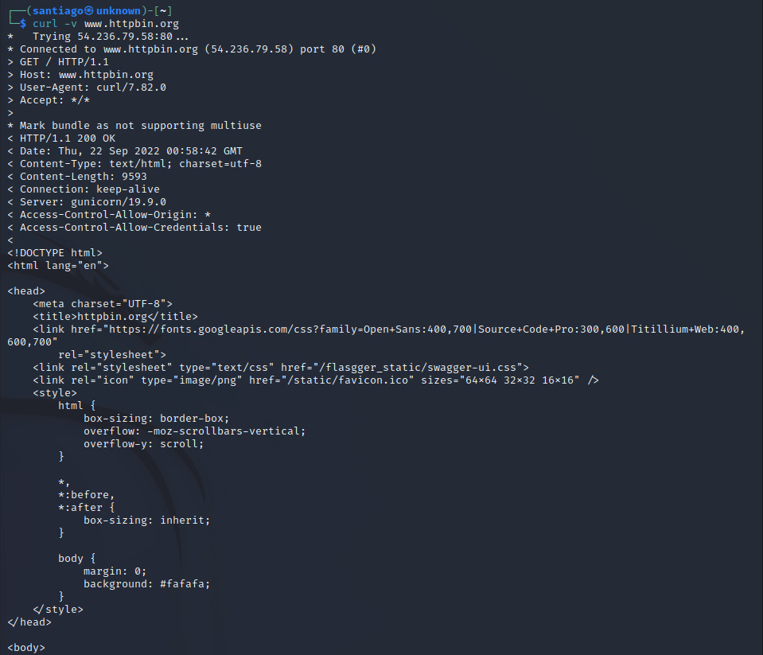

El parametro "-i" nos muestra mas informacion extra de la peticion como el tipo de contenido, el numero de lineas, servidor entre otra.
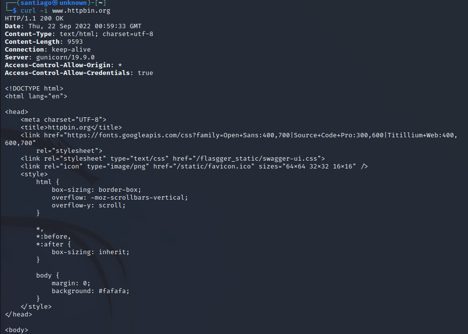

## PARTE 2. HACIENDO UNA APLCIACIÓN WEB DINÁMICA A BAJO NIVEL

3. El puerto TCP/IP de Tomcat está configurado como el 8080

4.
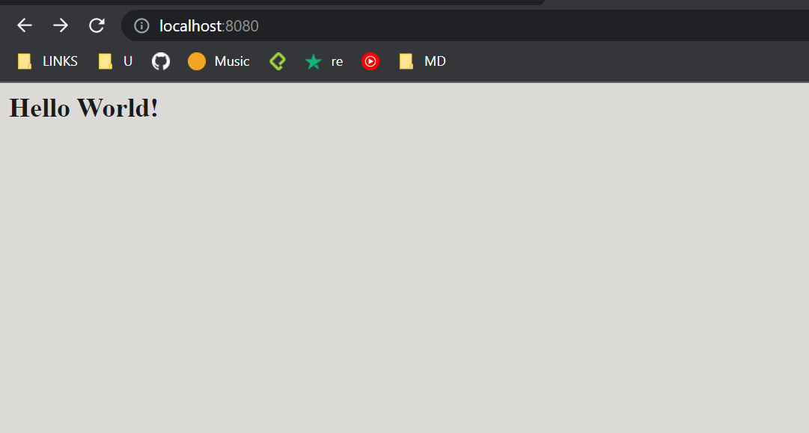

5.
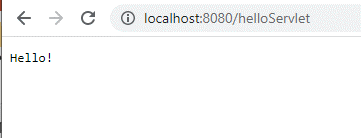

6.
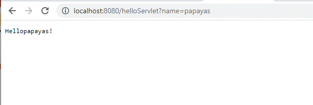

8.
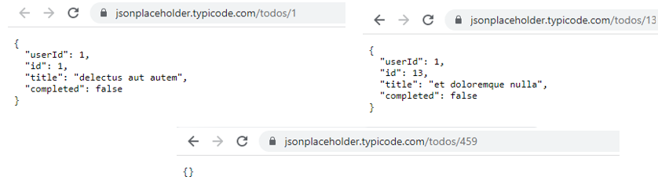

10-15
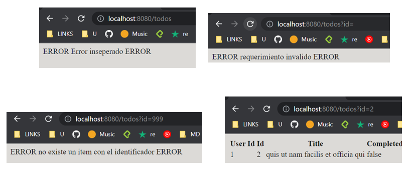

Evidencia implementación del post
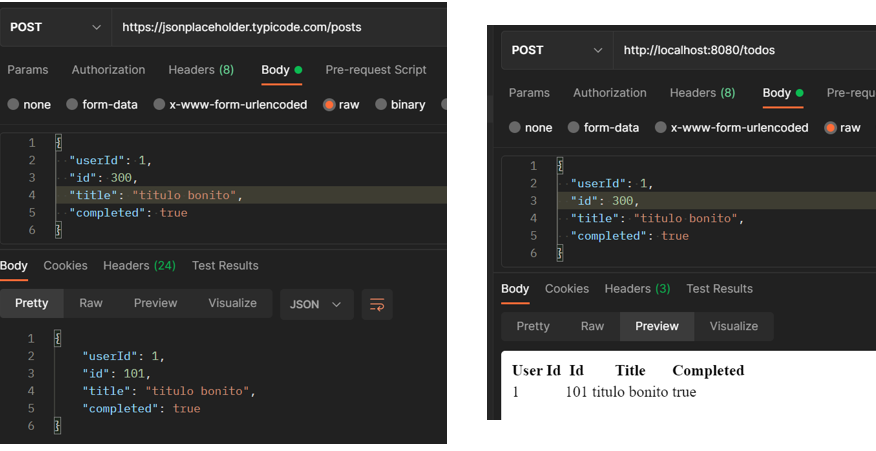

## PARTE III

17. URL: http://localhost:8080/index.html

20. La diferencia es que con el GET funciona y con el POST no. El motivo es que el POST está configurado para postear un body, y lo que hace el form es simplemente enviaR los parametros que tengamos dentro de el a la URL, es por eso  que falla.

Usando GET:
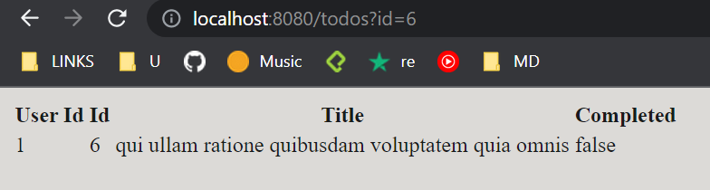

Usando POST:
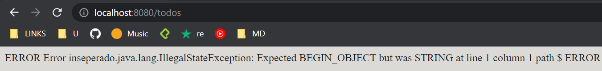

21. Lo que se está viendo es una renderización del codigo html que internamente está generando la clase  Service.java

## PARTE IV

Sobre esta parte todo lo solicitado está a excepción del punto 11 "Para facilitar los intentos del usuario, se agregará una lista de los últimos intentos fallidos realizado". El motivo es que obtuvimos un error cada que intentabamos usar la etiqueta p:read para poder iterar sobre nuestro arreglo de intentos.

10. c No coinciden, esto es porque @SessionScoped resetea las variables por sesión. En este caso basta con recargar el sitio para que se vuelva a instanciar una nueva clase con otro numero random. 

Por otro lado, @ApplicationScoped mantiene los datos de la clase 'vivos' mientras que el navegador no sea cerrado.

10. d Herramientas de desarrollador:
- Ubique el código HTML generado por el servidor
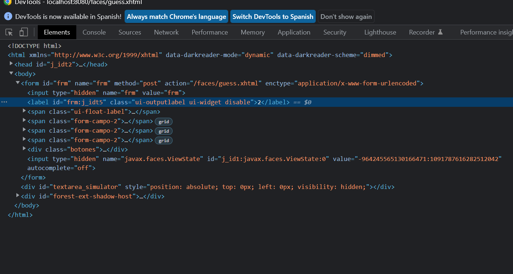

- Busque el elemento oculto, que contiene el número generado aleatoriamente
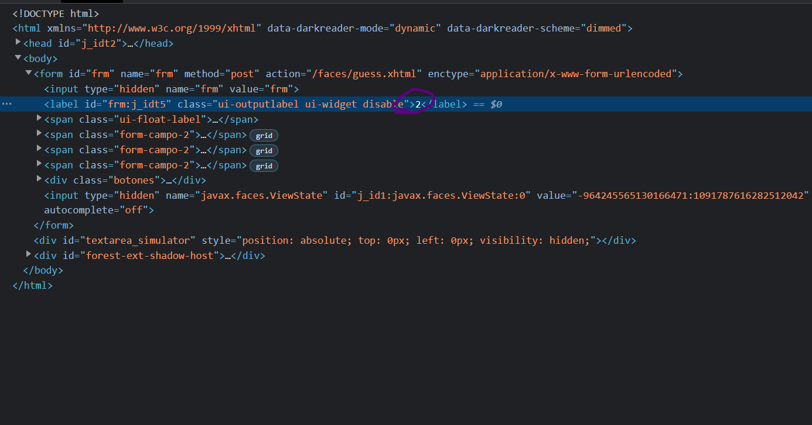

- En la sección de estilos, deshabilite el estilo que oculta el elemento para que sea visible.
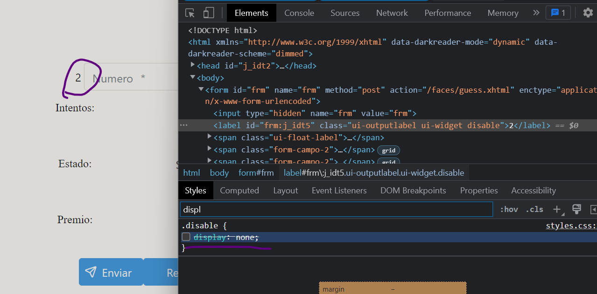

- Revise qué otros estilos se pueden agregar a los diferentes elementos y qué efecto tienen en la visualización de la página: Se puede agregar cualquier estilo que sea soportado por CSS.

- Revise qué otros cambios se pueden realizar y qué otra información se puede obtener de las herramientas de desarrollador: Se puede editar el html, o atributos que tengan los nodos por ejemplo. Otra información importante es la que se puede observar en "network". Aquí se ve el trafico de peticiones que han tenido relación con la aplicación.

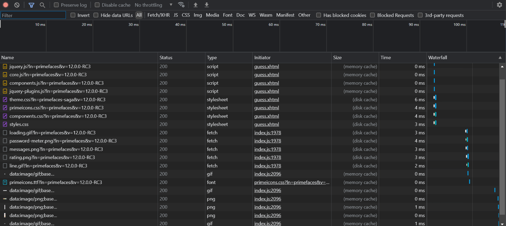

