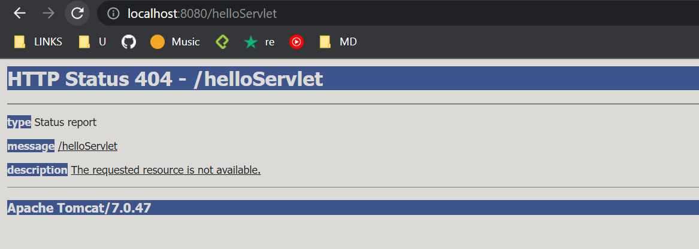

# Laboratorio 5

## PARTE 1. JUGANDO A SER UN CLIENTE HTTP
//TODO 

## PARTE 2. HACIENDO UNA APLCIACIÓN WEB DINÁMICA A BAJO NIVEL
// TODO SampleServlet class

El puerto TCP/IP de Tomcat está configurado como el 8080

